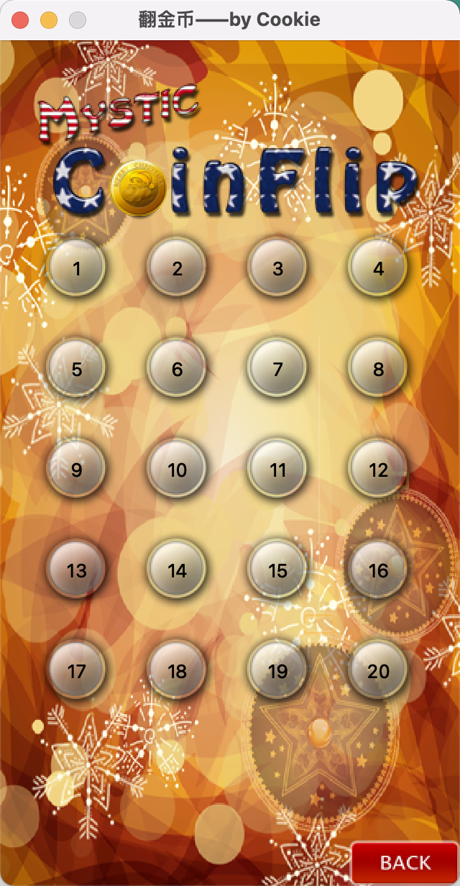

# 背景说明
这是一个基于QT5.9的翻金币游戏，[技巧总结](./skills.txt) 列出了开发过程中遇到的常见功能的实现方法\
参考资料：[B站：最新QT从入门到实战完整版|传智教育](https://www.bilibili.com/video/BV1g4411H78N?p=1)

# 项目架构
## main.cpp
> 项目入口文件，固定写法
~~~C++
#include "mainwindow.h"
#include <QApplication>

int main(int argc, char *argv[])
{
    QApplication a(argc, argv);
    MainWindow w;
    w.show();

    return a.exec();
}
~~~

## 一、场景界面
### 1.1 mainwindow.cpp
> 主场景搭建，第一场景，包括窗口的跳转
- MainWindow: 构造函数
    1. 窗口初始化: 大小、标题、标题图标、菜单栏退出按钮(通过ui文件实现)
    2. 加载开始场景音效
    3. 主场景搭建: 开始按钮的弹跳动画 + 新窗口的跳转

- paintEvent: 重写 paintEvent 事件添加背景图片

### 1.2 levelwindow.cpp
> 关卡选择场景搭建，第二场景，包括窗口的跳转与信息的传递
- LevelWindow: 构造函数
    1. 窗口初始化: 大小、标题、标题图标、菜单栏退出按钮
        - 选择关卡音效 + 返回按钮音效
    2. 主场景搭建: 关卡选择的button + 关卡选择的label
        - 跳转的时候携带信息是通过构造函数实现的
        - 里存在文字对齐和事件穿透的问题
    3. 下方的返回按钮: 返回按钮的封装

- paintEvent: 重写 paintEvent 事件添加背景图片

### 1.3 playwindow.cpp
> 游戏场景搭建，涉及翻转金币的核心逻辑
- PlayWindow: 构造函数
    1. 窗口初始化: 大小、标题、标题图标、菜单栏退出按钮
    2. 加载资源: 音效 + 胜利图片(等待胜利后砸下来)
    3. 保存基本信息: 当前关卡，初始化的金币还是银币位置
    4. 主场景搭建: 16个灰色背景框 + 16个初始金币(并赋值属性) + 1个存放金币的二维数组
        - 遍历二维数组，监听所有的金币点击事件
    5. 下方提示与返回: label的字体运用(字体字号大小)  +  返回按钮的封装
- flipCoins: 游戏场景中翻转金币
    1. coinArray中找到对应位置的金币进行翻转
    2. 维护 gameArray 的翻转结果(判定是否胜利)
    3. 延时翻转其余金币
- checkWinAndDoWin: 检测是否胜利
    1. 遍历gameArray，只要有反面就return
    2. 都是正面将 isWin 设置为true
    3. 将胜利图片砸下来
- paintEvent: 重写 paintEvent 事件添加背景图片

## 二、封装组件
### 2.1 mypushbutton.cpp
> 按钮的封装
> 1. 第一场景的开始按钮
> 2. 关卡选择场景的关卡选择按钮
> 3. 三个场景都用到的back按钮

- MyPushButton: 构造函数（第二个参数有默认值）
    1. 设置两个图片，设置图片样式(固定大小，去掉边框，加载图标图片)
- pressAnimation: 按压动画，当没有传递第二个参数时，可以调用此方法
    1. 按压动画: 设置动画: 起点和终点，时间和曲线
- mousePressEvent: 当提供了第二个参数时，按压时替换图片
    1. 重写mousePressEvent: 做到按压时更换图片
- mouseReleaseEvent
    1. 重写mouseReleaseEvent: 做到释放时把图片换回来

### 2.2 mycoin.cpp
> 金币的封装，游戏场景用到的金币，涉及动画的效果

- MyCoin: 构造函数
    1. 加载金币图片: 设置图片样式
    2. 监听翻转信号(正->反, 反->正)
        - 定义两个循环定时器: new QTimer(this);
        - 绑定timeout信号，加载图片
        - 如果翻转完了需要停止循环定时器
- flipCoin: 翻转金币
    1. 修改保存的正反标记位
    2. 启动对应的循环定时器（触发之前绑定的信号）

## 三、数据文件
### 3.1 dataconfig.cpp
> 每一关初始内容的封装\
> 格式：`QMap<int, QVector< QVector<int> > >mData;`
> 1. key: 关卡
> 2. value: 二维数组保存初始化是金币还是银币 1金币 0银币 
- dataConfig: 构造函数
    1. 填充数据map
        
